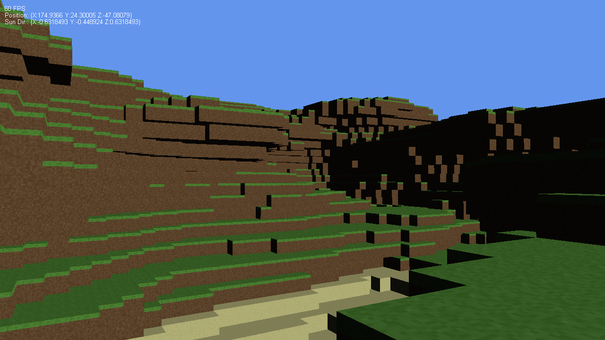

# Kyoob v0.2.1

Ever since first playing Minecraft, I've toyed around with the idea of making
my very own voxel engine. Kyoob is the result of my turning the idea into
something tangible.

## Requirements

* [XNA 4.0 Refresh](http://www.microsoft.com/en-us/download/details.aspx?id=27599) ([redistributable](http://www.microsoft.com/en-us/download/details.aspx?id=27598))
  * [See here](http://what-ev.net/2014/02/19/the-xna-enabler-app-xna-in-visual-studio-2012-2013/)
    if you're using VS2012 or VS2013
  * Also .NET Framework 4.0

## Todo

* Add GUI items (button, etc.)
* Prevent walking off map (mainly for slower computers)
* Fix gravity problems when vsync is disabled
* Fix lens flare draw order (?)
* Fix physics for far away places (coordinates in the thousands)
  * "Normalize" the block and player positions for physics calculations
* Adapt sun so that it doesn't act weird "at night"
* Improve block generation, taking hints [from Notch](http://n0tch.tumblr.com/post/4231184692/terrain-generation-part-1)
  * Actual world generation (caves, trees, etc.)
* Loading and unloading of chunks from and to disk
* Water rendering
* Block editing
* Motion blur?
* Re-implement the console/terminal?
* Move main library code over to separate library to facilitate plugin creation?

## Special Thanks

* Sean James for writing [3D Graphics with XNA Game Studio 4.0](http://www.amazon.com/Graphics-XNA-Game-Studio-4-0/dp/1849690049) (I highly recommend picking it up if you plan on doing
  serious XNA development)
* Microsoft for being such swell people and providing so many free XNA samples,
  such as their lens flare and sky sphere demos
* Nick and Jessie for helping me test this

## License

All of my code in this repository is released under the [MIT license](license.md).